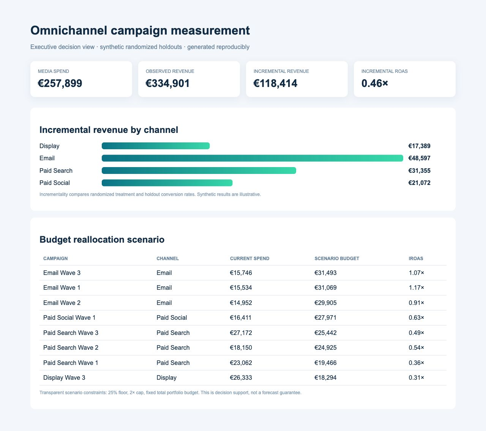
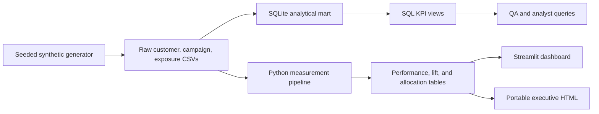

# Omnichannel Campaign Measurement & Budget Optimization

An end-to-end marketing analytics case study that separates **incremental demand** from attributed demand, then turns experiment results into a constrained budget scenario.

> Portfolio project: all customers, campaigns, outcomes, and euro values are synthetic. The pipeline is deterministic and makes no claim about a real company.



## Executive snapshot

| Decision metric | Reproducible result |
|---|---:|
| Customers | 6,000 |
| Randomized campaign assignments | 72,000 |
| Campaigns / channels | 12 / 4 |
| Media spend | €257,899 |
| Observed revenue | €334,901 |
| Estimated incremental revenue | €118,414 |
| Portfolio incremental ROAS | 0.46× |
| Campaigns with a positive 95% lift interval | 10 of 12 |

The analysis reveals the central decision risk: observed ROAS includes conversions that would have happened without marketing. A randomized holdout estimate produces a more conservative view of performance and supports a fixed-budget reallocation scenario with explicit guardrails.

## Business questions

1. Which campaigns generate conversions rather than merely receive attribution?
2. How do observed ROAS and incremental ROAS change the ranking?
3. Where should the same total budget move under transparent floor and cap constraints?
4. Which claims are sufficiently supported by the experiment, and which remain uncertain?

## What is inside

- **Synthetic experiment design:** seeded customer profiles, 80/20 treatment-control assignment, heterogeneous baseline behavior and channel lift.
- **Analytics engineering:** raw CSVs, a SQLite analytical mart, reusable SQL views, and processed decision tables.
- **Measurement:** funnel KPIs, conversion-rate lift, normal-approximation 95% intervals, incremental conversions/revenue, and incremental ROAS.
- **Decision layer:** a fixed-budget allocation scenario with a 25% campaign floor and 2× cap.
- **Communication:** portable HTML executive view, interactive Streamlit app, business documentation, tests, and CI.

## Architecture



## Reproduce it

```bash
python3 -m venv .venv
source .venv/bin/activate
pip install -r requirements.txt
make all
make dashboard
```

Open `outputs/executive_dashboard.html` for the zero-server report, or visit the local URL printed by Streamlit. `make all` regenerates the data, database, outputs, and tests.

## Repository map

```text
app/dashboard.py                 interactive decision dashboard
data/raw/                       seeded synthetic source tables
data/processed/                 SQLite mart and analysis tables
docs/                           business, data, and methodology notes
notion/case-study.md             publish-ready Notion narrative
outputs/executive_dashboard.html portable executive view
sql/schema.sql                   analytical views
sql/analysis.sql                 decision-oriented SQL questions
src/generate_data.py             deterministic experiment generator
src/analytics.py                 metrics and allocation logic
src/pipeline.py                  end-to-end build
tests/                           data and model logic checks
```

## Decisions and limitations

- Randomized holdouts make treatment-control differences interpretable **inside this simulation**; they do not validate the assumed synthetic data-generating process.
- The 95% interval uses a simple large-sample approximation and does not correct for repeated comparisons.
- Incremental revenue uses the treated group’s average order value. A production analysis would examine margin, delayed conversion, cross-device identity, interference, and customer-level clustering.
- The allocator is an auditable scenario, not an optimizer trained on response curves. It deliberately avoids promising that historical iROAS will persist at higher spend.

## Skills demonstrated

`SQL` · `Python` · `pandas` · `experimental design` · `incrementality` · `marketing KPIs` · `budget scenario modeling` · `SQLite` · `Streamlit` · `data storytelling` · `testing` · `GitHub Actions`

See [the methodology](docs/methodology.md), [data dictionary](docs/data-dictionary.md), and [Notion case study](notion/case-study.md) for the full interview narrative.
